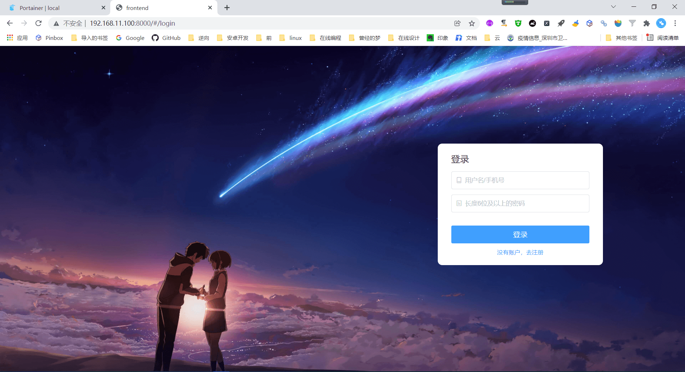
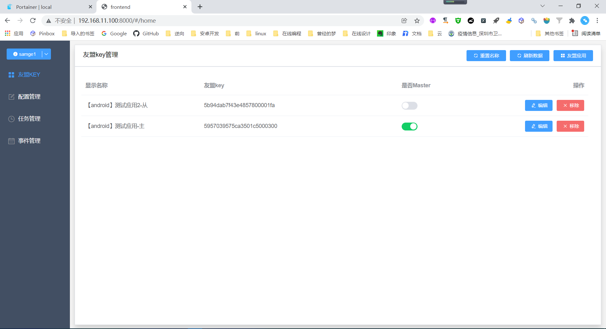
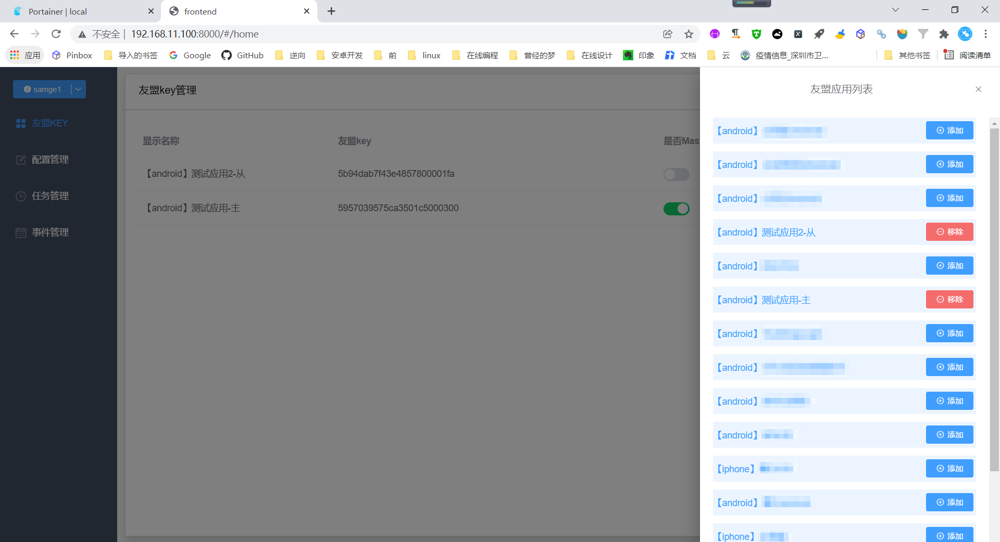
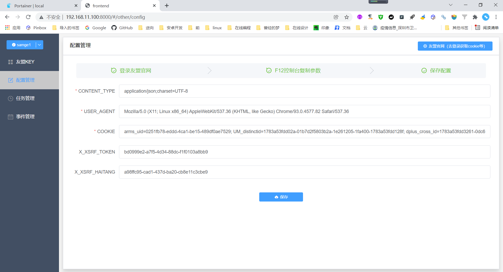
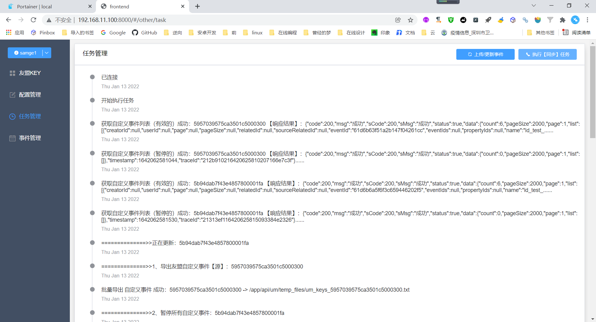
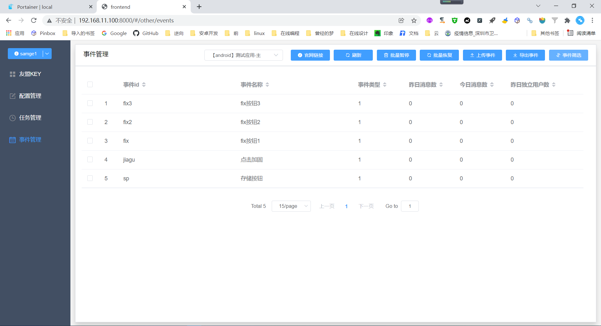
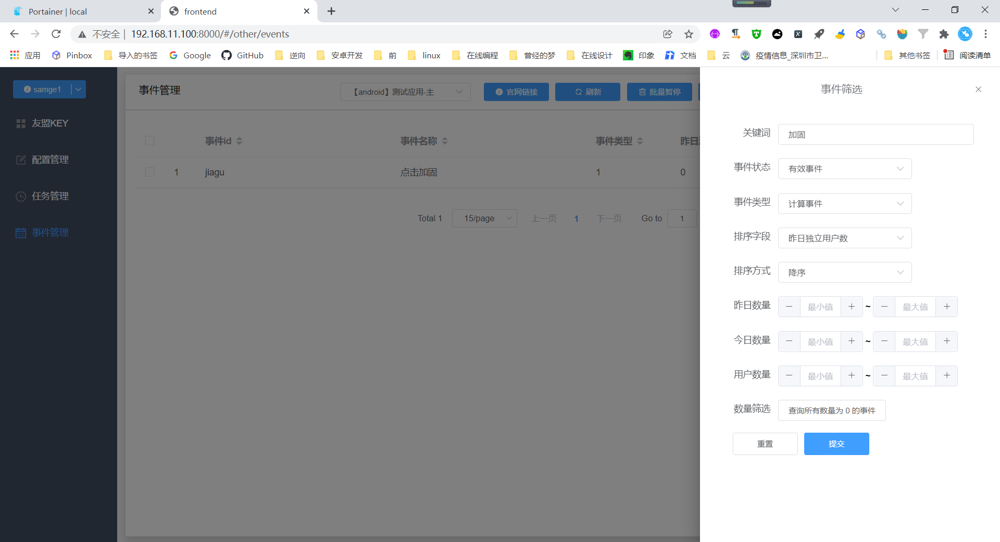
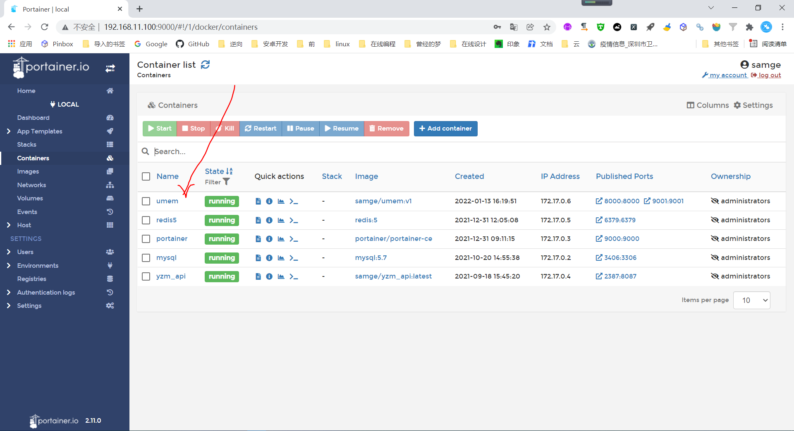

### 一、介绍
友盟自定义事件多应用同步管理小工具（django+vue版本）

### 二、运行docker镜像

- 创建本地目录，用于挂载docker运行时的log目录
```
mkdir -p ~/umem/log
mkdir -p ~/umem/db
```

- run docker （ -e LANG=C.UTF-8 是解决python处理中文的问题, 这里的/home/samge/umem是对应宿主机的绝对路径 ）:
```
docker run -d \
-v /home/samge/umem/db:/app/db \
-v /home/samge/umem/log:/app/log \
-p 8000:8000 \
-p 9001:9001 \
--name umem \
--pull=always \
--restart always \
-e LANG=C.UTF-8 \
samge/umem:v1
```

### 三、访问

访问地址：[http://localhost:8000](http://localhost:8000)
<br>Supervisor管理页面：[http://localhost:9001/](http://localhost:9001/)
```
Supervisor账号：admin
Supervisor密码：admin
```

### 四、使用

- 1、注册账号登录
- 2、进入“配置管理”页，配置友盟那边登录后的cookie等相关信息
- 3、在“友盟key”页，选择需要操作的友盟应用
- 4、配置完成，可进行测试/使用


### 五、相关截图


















### 六、如需源码编译

- 运行服务端
  
    - 安装依赖
    ```
      pip install -r requirements.txt
    ```
  
    - 初始化数据库
    ```
      python manage.py makemigrations api && python manage.py migrate
    ```
  
    - 运行服务
    ```
      python manage.py runserver localhost:8000
    ```

- 运行前端
  
    - 移动到frontend目录下
    ```
      cd frontend
    ```
  
    - 安装依赖
    ```
      npm i
    ```
  
    - 运行
    ```
      npm run serve
    ```