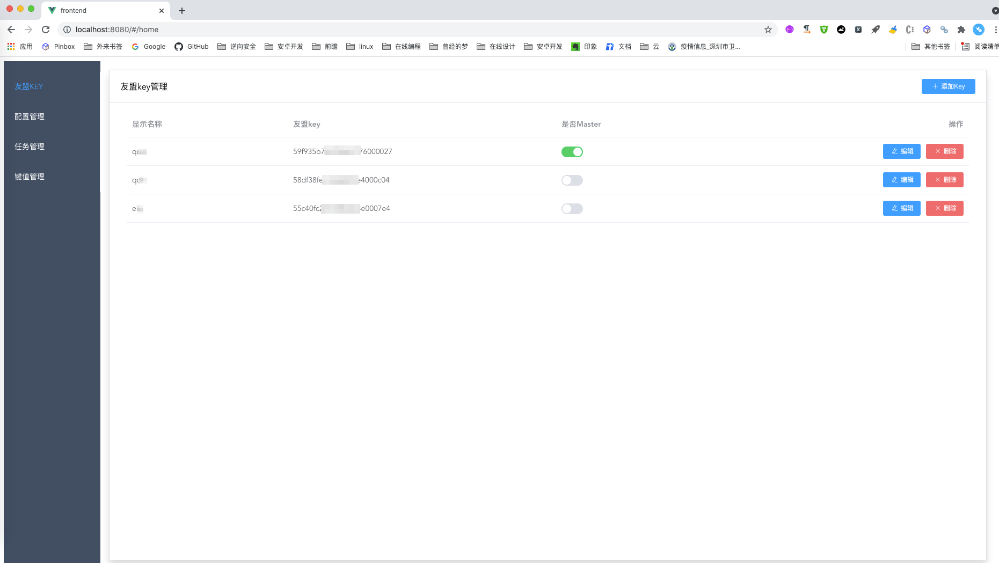
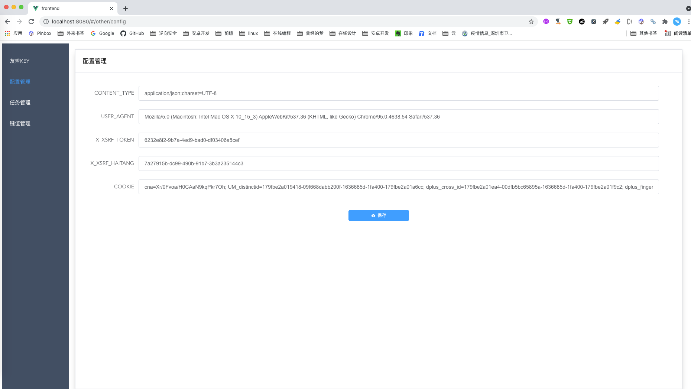

### 一、介绍
友盟自定义事件多应用同步小工具（django+vue版本）后续计划打为docker包，如需直接运行版本，可以切换到[original](https://gitee.com/samge007/UmengEventManage/tree/original) 分支


### 二、流程
有多个应用包需要同步修改自定义事件时使用，流程：

- 1、【主包A】的自定义事件整理（暂停/新增自定义事件/修改自定义事件的显示名称）；
- 2、在settings.py文件中配置友盟后台登录后的token、cookie等信息；
  - 2.1、登录之后，f12查看请求参数；
  - 2.2、将请求参数一一配置到settings.py文件中；
- 3、调用api保存【主包A】的自定义列表；
- 4、暂停【应用包B】、【应用包C】、【应用包...n】所有的自定义事件；
- 5、将【主包A】中的自定义事件导入到各个应用包中；或者使用【批量复制功能】；
- 6、重复步骤4；
- 7、根据源中相同的key名进行批量恢复显示；
- 8、修改计算事件类型为calculation（此步骤非必须）：multiattribute -》 calculation；
- 9、完成。

### 三、使用

- 安装django依赖
```
pip install -r requirements.txt
```
- 安装vue前端依赖，先 cd frontend 目录下，
```
npm i
```
- 运行django服务
```
cd server && python manage.py runserver 0:8000
```
- 运行vue前端界面
```
cd frontend && npm run serve
```

### 四、截图





